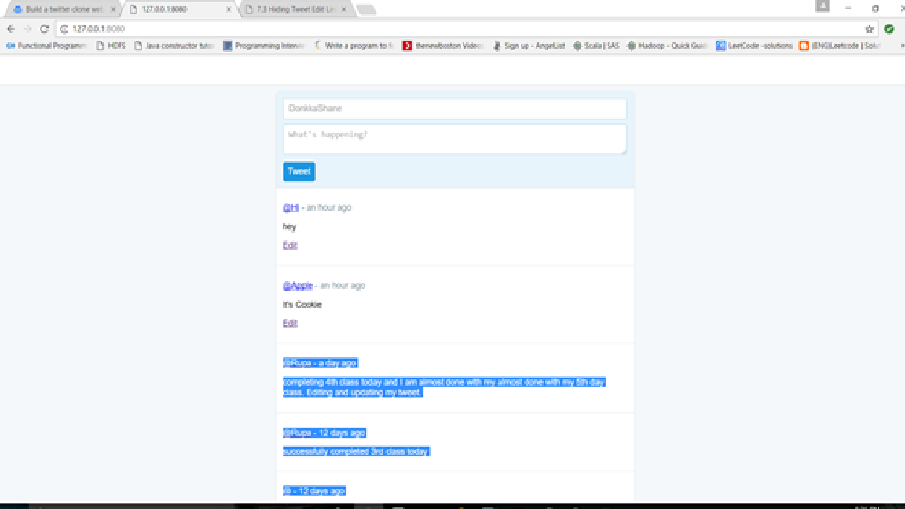

Home Page

In this Project, you will learn how to:
•	Code a web server in JavaScript using Node.js
•	Build and style web pages with HTML and CSS
•	Read and write to a database using SQL
•	Run commands in the terminal

Before we can start coding, we need to install some tools that we are going to use to build our Twitter clone. 

1.) Install VM

2.) Install Vagrant
	VirtualBox allows us to create VMs but that's about it. With VMs there is generally a lot of configuration that 
has to be done to get started. Because of this, we use a program called Vagrant to manage the VM for our project.

3.) Install Sublime/any Editor which you are comfortable

4.) Install HeidiSQL

5.) Install Putty

To set up our project, we need to create a place to store our project files and connect to our VM so we can develop our web app in it.

	Open Sublime Text 3 and go to File > New File. Now go to File > Save As and save this file in our "TwitterClone" folder 
we just made and give it the name "Vagrantfile". Copy the Vagrantfile code and save it.

Connect to the VM:

# Terminal (or PowerShell) on host computer
vagrant box add --name node-mysql "https://s3.amazonaws.com/spark-school/node-mysql.box"

Now our VM got connected to turn on the Vagrant use command. 

# Terminal on PowerShell
vagrant up
If your Vagrantfile is correct, vagrant should start your VM and tell you everything worked successfully.

# Terminal on PowerShell
vagrant ssh-config
Vagrant will take care the our user authentication for us. you will be getting hostname and port number using this open the Putty.

You are now logged into your VM and are ready to get started. All terminal commands from here on out will assume you are logged into your VM. 

Every command will be running in the VM Terminal. Install Node.js, Express etc..

Copy all the files and save it in the same folder and test it in the webpage like chrome.

